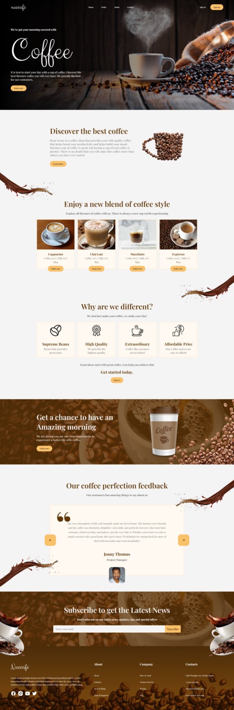

# ☕ Cafetería SPA

Este proyecto es una página web para una cafetería diseñada como una **Single
Page Application (SPA)**. Con un diseño moderno y responsivo, esta web destaca
por animaciones fluidas y componentes reutilizables desarrollados con
**JavaScript Vanilla**.

---

## 🚀 **Características principales**

- 🌟 **Diseño moderno**: Basado en un diseño gratuito de Figma.
- 🔄 **Componentes reutilizables**: Organizados y creados con JavaScript
  Vanilla.
- 📱 **Responsive Design**: Adaptado para diferentes tamaños de pantalla.
- 🎞️ **Animaciones fluidas**: Implementadas con la API de **Intersection
  Observer** de JavaScript.
- ⚡ **Creado con Vite**: Para una experiencia de desarrollo ágil y moderna.

---

## 📸 **Vista previa**

## 🌐 **Enlace al proyecto**

🔗 [Visita la página web aquí](#)

---

## 📬 Contacto

